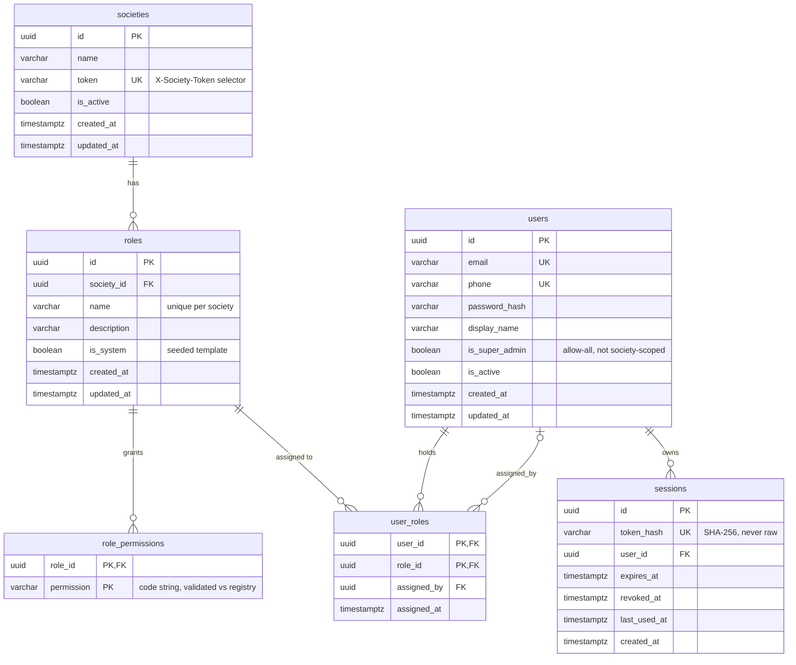

# Database Schema — RBAC + Sessions

Entity-relationship diagram of the current schema (`src/db/schema/`). Renders automatically on GitHub;
in VS Code install **Markdown Preview Mermaid Support** and open the preview (`Ctrl+Shift+V`).

## Reading the relationships

- A **society** has many **roles**; deleting a society cascades to its roles.
- A **role** grants many **role_permissions** (permission strings from the code registry — no FK).
- A **user** holds many **user_roles**; a **role** is assigned to many users. The society is derived
  through the role, so effective permissions = union of the user's roles within the selected society.
- `user_roles.assigned_by` is an optional self-reference to the **user** who granted the role.
- A **user** owns many **sessions** (identity only; society is per-request, not stored).
